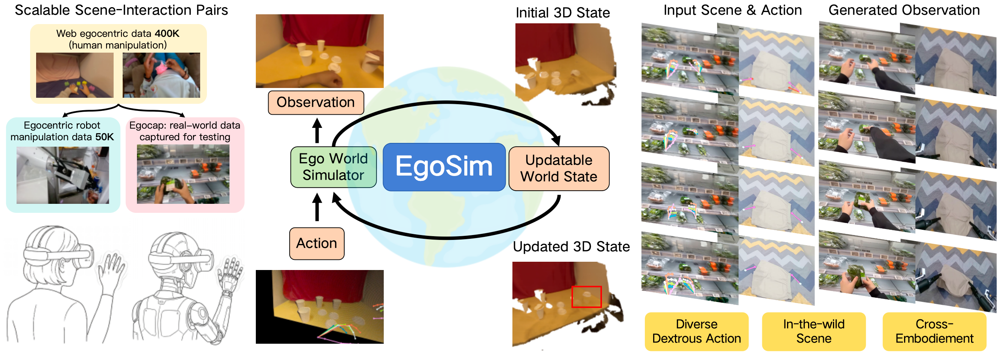

# EgoSim: Egocentric World Simulator for Embodiment Interaction Generation

<div align="center">


[Jinkun Hao](https://jinkun-hao.github.io/)<sup>1*</sup>, [Mingda Jia](https://luyitas.github.io/)<sup>2*</sup>, Ruiyan Wang<sup>1</sup>, [Xihui Liu](https://xh-liu.github.io/)<sup>3</sup>, [Ran Yi](https://yiranran.github.io/)<sup>1†</sup>, [Lizhuang Ma](https://dmcv.sjtu.edu.cn/people/)<sup>1†</sup>, [Jiangmiao Pang](https://oceanpang.github.io/)<sup>2</sup>, [Xudong Xu](https://sheldontsui.github.io/)<sup>2</sup>

<sup>1</sup> Shanghai Jiao Tong University &nbsp;&nbsp; <sup>2</sup> Shanghai AI Laboratory &nbsp;&nbsp; <sup>3</sup> The University of Hong Kong

<sup>*</sup> Equal Contribution &nbsp;&nbsp; <sup>†</sup> Corresponding Author

[](https://egosimulator.github.io/EgoSim__Controllable_Egocentric_Video_Simulation_with_Updatable_3D_Memory__arxiv_.pdf)
[](https://egosimulator.github.io/)

</div>

---

## Overview



**EgoSim** is an egocentric world simulator for embodiment interaction generation. Given an initial 3D state and a sequence of actions, EgoSim generates temporally and spatially consistent egocentric observations with high-quality dexterous interactions. EgoSim also persistently updates a 3D state for continuous simulation.

Key features:
- **Controllable egocentric video generation** conditioned on 3D scene state and action sequences
- **Updatable 3D memory** for long-horizon continuous simulation
- **Scalable data curation pipeline** for scene-interaction pairs
- **Few-shot generalization** to in-the-wild real scenes and multiple embodiments

## Code

Code will be released soon. Stay tuned!

## Citation

```bibtex
@inproceedings{hao2026egosim,
  title     = {EgoSim: Egocentric World Simulator for Embodiment Interaction Generation},
  author    = {Hao, Jinkun and Jia, Mingda and Wang, Ruiyan and Liu, Xihui and Yi, Ran and Ma, Lizhuang and Pang, Jiangmiao and Xu, Xudong},
  booktitle = {European Conference on Computer Vision (ECCV)},
  year      = {2026}
}
```
